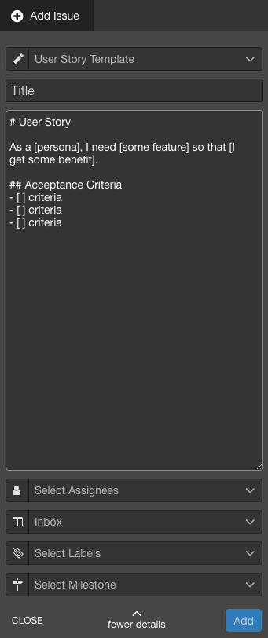

# 🍯 Honey Butter for Waffle.io

Honey Butter is a Chrome Extension that enables you to create and use Issue templates in Waffle.io! Templates are the 3rd [most requested feature](https://github.com/waffleio/waffle.io/issues/2398) in Waffle.io.

## How It Works

Honey Butter adds a template drop down to the Add Issue form in Waffle.io projects. You can select a template when creating an issue which will replace the issue descripton with the template. Templates are defined in this extension. In the future, the extension might use [GitHub Issue Templates](https://help.github.com/articles/manually-creating-a-single-issue-template-for-your-repository/).

## Installation

1. Go to chrome://extensions/ in Chrome's search box.
2. Enable Developer Mode in Chrome Extensions.
3. Click Load Unpacked and select the root directory where you cloned this repo. The extension will appear in the Extensions list.
4. Make sure the extension is enabled and refreshed.
5. Navigate to any Waffle project (ex. https://waffle.io/waffleio/waffle.io).
6. When selecting Add Issue, thre will be a Select Template drop down in the new issue form.

Note: When this extension is enabled, card headers are colored yellow to remind you the extension is enabled.

## Examples

Example of creating a new issue using a template:

## Extending

1. Clone this repo.
2. See [Chrome Extensions - Getting Started](https://developer.chrome.com/extensions/getstarted) to learn how to install and run this extension locally. Make sure you refresh the extention after make changes!
